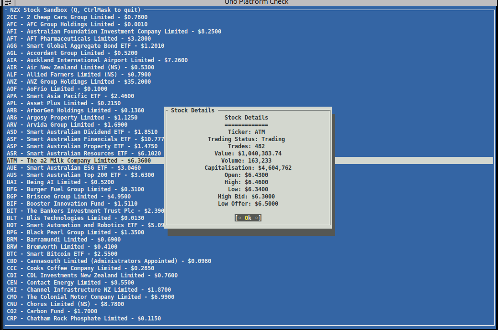

# NZX Scraper Sandbox

This project is a sandbox application written in C# that scrapes the NZX (New Zealand Stock Exchange) website to extract stock data.

## Features

- Scrapes stock information from the NZX website
- Displays detailed stock data, including trading status, value, volume, and more
- Simple and easy-to-use console interface for viewing stock information

## Getting Started

### Prerequisites

- [.NET SDK](https://dotnet.microsoft.com/download) (version X.X or later)

### Dependencies

This project uses the following NuGet packages:

- **HtmlAgilityPack**: Version 1.11.68 - for parsing HTML documents.
- **Terminal.Gui**: Version 1.17.1 - for creating terminal-based user interfaces.

